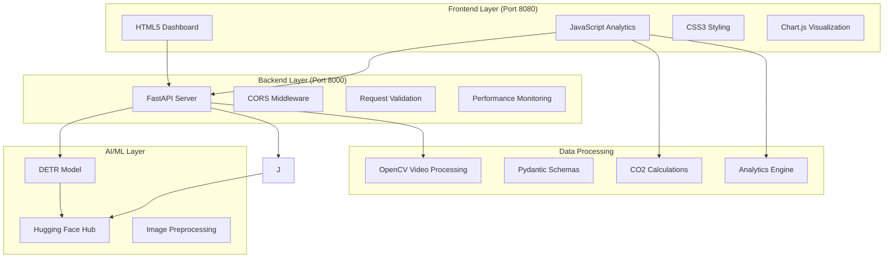
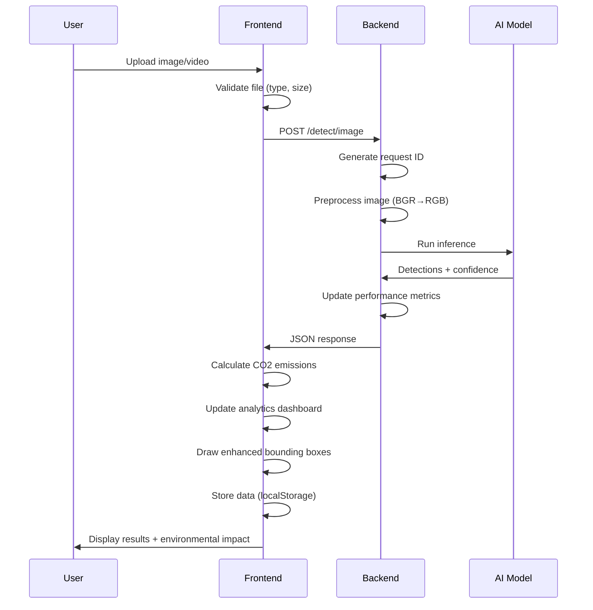
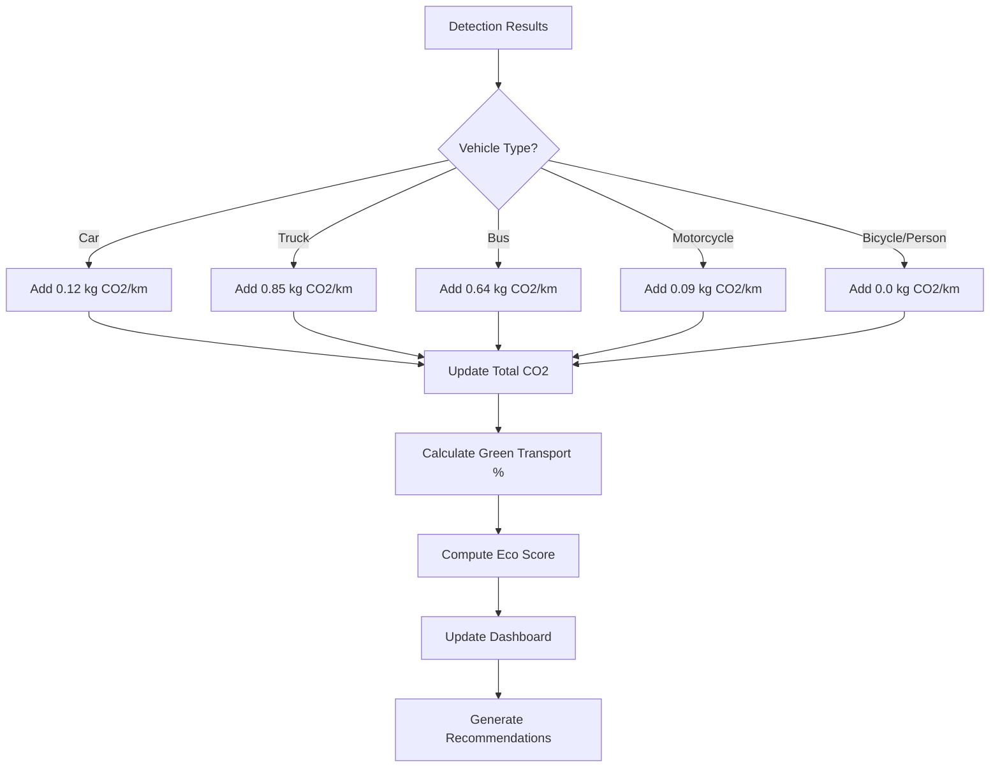

# System Architecture

## 🏗️ Overview

The AI Traffic Control System follows a **three-tier architecture** designed for scalability, maintainability, and real-time performance.



## 🔧 Backend Architecture (FastAPI)

### Core Components

#### 1. **FastAPI Application** (`app/main.py`)
```python
app = FastAPI(title="ML Gateway", version="0.1.0")

# CORS Configuration
app.add_middleware(
    CORSMiddleware,
    allow_origins=["*"],
    allow_credentials=True,
    allow_methods=["*"],
    allow_headers=["*"],
)
```

**Key Features**:
- Automatic OpenAPI documentation
- Request/response validation
- Performance metrics tracking
- Enhanced logging with request IDs
- Error handling and HTTP status codes

#### 2. **Model Inference Engine** (`app/infer.py`)
```python
class Detector:
    def __init__(self):
        # Uses DETR via Transformers pipeline
        self.pipe = pipeline("object-detection", model="facebook/detr-resnet-50")
        self.model_name = "facebook/detr-resnet-50"
        self.backend = "detr"
    
    def predict_image(self, img_bgr: np.ndarray) -> ImageDetections:
        # Convert BGR to RGB
        img_rgb = img_bgr[:, :, ::-1]
        
        # DETR pipeline expects PIL Image
        img_pil = Image.fromarray(img_rgb)
        predictions = self.pipe(img_pil)
        # Process DETR results...
            # Process DETR results...
```

**Model Integration**:
- **DETR (Current)**: Facebook's DEtection TRansformer
  - Model: `facebook/detr-resnet-50`
  - Input: PIL Images (RGB format)
  - Output: Bounding boxes, labels, confidence scores
  - Downloaded from Hugging Face Hub
  - Configurable confidence/IoU thresholds

#### 3. **Data Schemas** (`app/schemas.py`)
```python
class BBox(BaseModel):
    x1: float; y1: float; x2: float; y2: float

class Detection(BaseModel):
    bbox: BBox
    label: str
    cls_id: int | None = None
    score: float

class ImageDetections(BaseModel):
    model: str
    detections: List[Detection] = Field(default_factory=list)

class VideoDetections(BaseModel):
    model: str
    total_frames: int
    processed_frames: int
    fps_sample: int
    results: List[VideoFrameDetections] = Field(default_factory=list)
    counts_by_label: dict[str, int] = Field(default_factory=dict)
```

#### 4. **Video Processing Pipeline** (`app/video.py`)
```python
def detect_on_video(source_path: str) -> VideoDetections:
    cap = cv2.VideoCapture(source_path)
    
    # Intelligent frame sampling
    frames = _sample_frames(cap, fps_sample=2, max_frames=120)
    
    results = []
    for frame_idx, frame in enumerate(frames):
        detections = detector.predict_image(frame)
        results.append(VideoFrameDetections(...))
    
    # Aggregate statistics
    counts_by_label = Counter()
    for result in results:
        for detection in result.detections:
            counts_by_label[detection.label] += 1
    
    return VideoDetections(...)
```

### API Endpoints

| Endpoint | Method | Description | Response |
|----------|--------|-------------|----------|
| `/health` | GET | System health & metrics | JSON with uptime, memory, performance |
| `/metrics` | GET | Real-time performance data | JSON with request stats, response times |
| `/detect/image` | POST | Image object detection | ImageDetections schema |
| `/detect/video` | POST | Video analysis (file/URL) | VideoDetections schema |
| `/docs` | GET | Interactive API documentation | Swagger UI |

### Performance Monitoring

```python
# Global performance tracking
performance_metrics = {
    "requests_count": 0,
    "average_response_time": 0,
    "total_detections": 0,
    "start_time": time.time()
}

# Request-level monitoring
@app.post("/detect/image")
async def detect_image(request: Request, file: UploadFile = File(...)):
    request_id = str(uuid.uuid4())[:8]
    start_time = time.time()
    
    logger.info(f"Request {request_id}: Image detection started - file: {file.filename}")
    
    # ... processing ...
    
    total_time = time.time() - start_time
    performance_metrics["requests_count"] += 1
    performance_metrics["total_detections"] += len(result.detections)
    
    logger.info(f"Request {request_id}: Completed - {len(result.detections)} detections in {total_time:.3f}s")
```

## 🎨 Frontend Architecture

### Component Structure

#### 1. **Core JavaScript** (`script.js`)
```javascript
// Global state management
let analytics = {
    totalVehicles: 0,
    totalPedestrians: 0,
    totalCyclists: 0,
    totalDetections: 0,
    accuracyRate: 95.2,
    totalCO2: 0,
    co2ByVehicleType: { 'car': 0, 'truck': 0, 'bus': 0, 'motorcycle': 0 },
    recentDetections: [],
    entityCounts: {}
};

// CO2 emission factors (kg CO2/km per vehicle type)
const CO2_EMISSIONS = {
    'car': 0.12,        // Average car: 120g CO2/km
    'truck': 0.85,      // Heavy truck: 850g CO2/km
    'bus': 0.64,        // City bus: 640g CO2/km
    'motorcycle': 0.09, // Motorcycle: 90g CO2/km
    'bicycle': 0.0,     // Bicycle: 0g CO2/km (eco-friendly!)
    'person': 0.0       // Pedestrian: 0g CO2/km (walking is green!)
};
```

#### 2. **Smart Label Positioning System**
```javascript
function drawBoundingBoxes(ctx, detections, canvasWidth, canvasHeight, originalWidth, originalHeight) {
    const usedLabelPositions = [];
    
    detections.forEach((detection, index) => {
        // Calculate optimal label position
        const labelPos = calculateOptimalLabelPosition(
            scaledBbox, 
            labelWidth, 
            labelHeight, 
            canvasWidth, 
            canvasHeight,
            usedLabelPositions
        );
        
        // Enhanced visual styling
        const gradient = ctx.createLinearGradient(0, labelPos.y - labelHeight, 0, labelPos.y);
        gradient.addColorStop(0, color);
        gradient.addColorStop(1, adjustColorBrightness(color, -0.2));
        
        // Smart contrast text color
        ctx.fillStyle = getContrastColor(color);
    });
}
```

#### 3. **Real-time Analytics Engine**
```javascript
function processDetectionResults(detections, isVideo = false) {
    let sessionCO2 = 0;
    
    detections.forEach(detection => {
        const label = detection.label.toLowerCase();
        
        // Update entity counts
        analytics.entityCounts[label]++;
        
        // Calculate CO2 emissions
        if (CO2_EMISSIONS.hasOwnProperty(label)) {
            const co2ForVehicle = CO2_EMISSIONS[label];
            analytics.totalCO2 += co2ForVehicle;
            analytics.co2ByVehicleType[label] += co2ForVehicle;
            sessionCO2 += co2ForVehicle;
        }
        
        // Categorize detections
        if (['car', 'truck', 'bus', 'motorcycle'].includes(label)) {
            analytics.totalVehicles++;
        } else if (label === 'person') {
            analytics.totalPedestrians++;
        } else if (label === 'bicycle') {
            analytics.totalCyclists++;
        }
    });
    
    // Environmental impact notifications
    if (sessionCO2 > 0.5) {
        showNotification(`High CO₂ impact detected: ${(sessionCO2 * 1000).toFixed(0)}g CO₂/km`, 'warning');
    }
}
```

## 🔄 Data Flow Architecture

### Request Processing Pipeline



### Environmental Impact Processing



## 🚀 Performance Optimizations

### Backend Optimizations
1. **Request ID Tracking**: Unique identifiers for debugging and monitoring
2. **Async Processing**: FastAPI's async/await for concurrent requests
3. **Memory Management**: Proper cleanup of temporary video files
4. **Error Handling**: Graceful degradation with detailed error messages
5. **Performance Metrics**: Real-time tracking of response times and throughput

### Frontend Optimizations
1. **Smart Label Positioning**: Collision detection prevents overlapping labels
2. **Canvas Optimization**: Efficient rendering with proper scaling
3. **Data Persistence**: localStorage for analytics continuity
4. **Lazy Loading**: Progressive enhancement of dashboard features
5. **Debounced Updates**: Efficient DOM manipulation

## 🔧 Configuration Management

### Environment Variables (`ml-gateway/.env`)
```bash
# DETR model is used by default
CONF_THRESHOLD=0.25               # Detection confidence threshold
VIDEO_FPS_SAMPLE=2                # Frame sampling rate
VIDEO_MAX_FRAMES=120              # Maximum frames to process
PORT=8000                         # Server port
HF_TOKEN=                         # Hugging Face token (optional)
```

### Model Configuration
```python
class Settings(BaseSettings):
    # DETR model configuration is handled internally
    conf_threshold: float = 0.25
    iou_threshold: float = 0.45
    video_fps_sample: int = 2
    video_max_frames: int = 120
    port: int = 8000
    hf_token: str | None = None
    
    class Config:
        env_file = ".env"
```

## 📊 Monitoring and Observability

### Logging Strategy
- **Request-level logging**: Unique IDs, processing times, file sizes
- **Error tracking**: Detailed stack traces and context
- **Performance logging**: Detection counts, response times
- **System monitoring**: Memory usage, CPU utilization

### Metrics Collection
- **API Metrics**: Request count, average response time, requests per minute
- **Detection Metrics**: Total detections, accuracy rates
- **Environmental Metrics**: CO2 calculations, green transport percentages
- **System Metrics**: Uptime, memory usage, error rates

This architecture provides a robust, scalable foundation for real-time traffic monitoring with environmental impact analysis, designed for both development and production environments.
